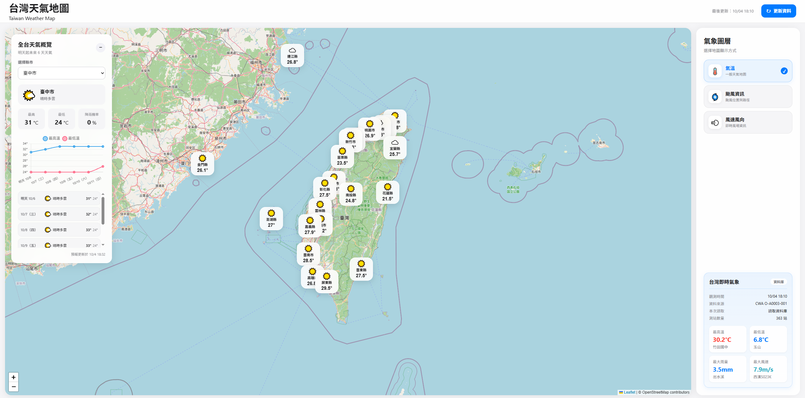

AIoT-DA 課程 — HW 1 專案說明文件 

## 📚 實作資訊

- **課程名稱**: AIoT 
- **作業實作**: HW-1 — Taiwan Weather GIS Dashboard
- **示範教師**: Huan Chen
- **學生 Live Demo Page**: [https://l3-ai-vibe-coding-hw-1.vercel.app/](https://l3-ai-vibe-coding-hw-1.vercel.app/)
- **學生儲存庫網址**: [https://github.com/PecoRun/L3-AI-vibe-coding-HW1](https://github.com/PecoRun/L3-AI-vibe-coding-HW1)

---

## 🌐 專案簡介



# Taiwan Weather GIS Dashboard

## AIoT L3 — CWA HW1

> **CWA Open Data → ETL → Database → Flask API → Taiwan GIS Web → GitHub → Vercel**

本作業以中央氣象署（CWA）真實 Open Data 為資料來源，透過 Python Flask 建立資料取得與 ETL 流程，將天氣資料儲存至 SQLite（本機）與 Neon PostgreSQL（Production），再透過 Flask API 提供前端 Taiwan GIS Web 使用。

前端使用 Leaflet + OpenStreetMap 建立臺灣天氣地圖，提供三種氣象圖層（氣溫、颱風資訊、風速風向）、全台 7 天天氣概覽，以及即時觀測統計，最後部署至 Vercel。

---

## ✨ 功能總覽

| 功能 | 說明 | 資料來源 |
|---|---|---|
| **氣溫圖層** | 22 個縣市天氣標記；放大到 12 級以上顯示鄉鎮標記，點擊可看鄉鎮預報 | F-C0032-001、F-D0047-093 |
| **全台天氣概覽**（左側） | 選擇縣市，顯示未來 7 天高低溫折線圖、天氣列表、預報更新時間。只在「氣溫」圖層顯示 | F-D0047-091 |
| **颱風資訊圖層** | 過去路徑、預報路徑、70% 機率圈、七級 / 十級風暴風圈、強度分級與資訊卡 | W-C0034-005 |
| **風速風向圖層** | 全臺測站風向箭頭（依蒲福風級上色）、風速標籤、點擊顯示測站詳細資料 | O-A0003-001 |
| **即時觀測統計**（右下） | 觀測時間、測站數量、最高溫 / 最低溫 / 最大雨量 / 最大風速及其測站 | O-A0003-001 |
| **更新資料按鈕** | 呼叫 CWA 更新即時觀測資料並寫入資料庫 | O-A0003-001 |

---

## 核心流程

```text
CWA Government Open Data
        ↓
     REST API
        ↓
       JSON
        ↓
Parse / Clean / Transform
        ↓
 ┌───────────────────────┐
 │ SQLite    │ Neon      │
 │ Local     │ PostgreSQL│
 └───────────────────────┘
        ↓
     Flask API
        ↓
Taiwan Weather GIS Web
        ↓
Leaflet + OpenStreetMap + Chart.js
        ↓
      GitHub → Vercel → Public Website
```

---

## CWA API

**資料來源：** 中央氣象署（CWA）Open Data。本專案使用 5 組資料集：

| 資料集 | 資料內容 | 用途 | 如何更新 |
|---|---|---|---|
| `O-A0003-001` | 全臺即時觀測（約 360 個測站） | 風速風向圖層、統計卡、縣市標記的天氣與溫度（優先採用該縣市的即時觀測，沒有時才用預報） | **網頁「更新資料」按鈕** |
| `F-C0032-001` | 一般縣市 3 天天氣預報 | 縣市標記的預報（點開標記可看） | `update_forecast.py` |
| `F-D0047-091` | 臺灣未來 1 週天氣預報 | 全台天氣概覽（7 天溫度圖、列表） | `update_forecast.py` |
| `F-D0047-093` | 鄉鎮天氣預報（22 縣市、368 鄉鎮） | 鄉鎮天氣浮動面板 | `update_forecast.py` |
| `W-C0034-005` | 熱帶氣旋（颱風）路徑與預報 | 颱風資訊圖層 | **不存資料庫**，每次由 `/api/typhoon` 即時呼叫 |

### 資料處理重點

- **7 天預報：** CWA 原始資料以 12 小時為一個時段，同一天的資料會彙整成一筆——最高溫取最高值、最低溫取最低值、降雨機率取最高值、天氣現象以白天 `06:00` 開始的時段為主。CWA 的 7 天預報只提供前幾天的降雨機率，之後幾天沒有資料，畫面會顯示 `—`。
- **即時觀測：** 缺值以負數表示（`-99`、`-990`），統計時會排除，不會出現「最低溫 -99°C」。
- **風向：** CWA 風向代表「風從哪裡吹來」，地圖上的箭頭指向「風吹往的方向」，因此會旋轉 180 度。
- **時間：** CWA 時間本來就是臺灣時間（`+08:00`），前端直接顯示，不做時區換算。「今天」一律以臺灣時間計算（伺服器在 Vercel 是 UTC）。

### API Key

CWA API Key 儲存在環境變數 `CWA_API_KEY`，不寫入程式碼或 Repository。

```env
CWA_API_KEY=your_cwa_api_key
```

## Database

採用雙資料庫策略，由環境變數 `DATABASE_BACKEND` 切換：

```text
Local Development   DATABASE_BACKEND=sqlite   （預設）→ database/weather.db
Production          DATABASE_BACKEND=postgres → Neon PostgreSQL（DATABASE_URL）
```

Production 使用 Neon，是因為 Vercel Serverless 的檔案系統無法持久寫入 SQLite。

### Database Tables

| 資料表 | 內容 |
|---|---|
| `locations` | 22 個縣市與座標 |
| `weather_forecast` | 縣市 3 天預報（12 小時時段） |
| `weather_daily_forecast` | 縣市每日預報（7 天概覽用） |
| `townships` | 368 個鄉鎮與座標 |
| `township_weather_forecast` | 鄉鎮每日預報 |
| `weather_observation` | 即時觀測，每個測站只保留最新一筆（`station_id` 唯一） |
| `update_log` | 更新紀錄 |

### ETL 流程

```text
CWA JSON → Parse → Validate → Transform → Delete old / Upsert → Commit
```

縣市預報是「先刪除該縣市舊資料，再寫入新資料」；鄉鎮預報與即時觀測是「有就更新、沒有就新增」（Upsert），鄉鎮預報的過期日期由 `update_forecast.py` 清除。

### Neon 初始化

```bash
python database/init_neon_db.py      # 建立 7 張資料表與 22 個縣市（可重複執行，已存在的不會被改動）
python database/verify_neon_db.py    # 檢查各資料表筆數
python database/migrate_sqlite_to_neon.py   # 選用：把本機 SQLite 搬到 Neon（會先清空 Neon 上的 6 張預報相關資料表）
```

> 新增 `weather_observation` 之前就建立的 Neon 資料庫，需要重新執行一次 `init_neon_db.py` 才會補上這張表；沒有它，風速風向圖層、統計卡與「更新資料」按鈕都無法運作。

---

## Backend API

| Method | 路徑 | 說明 |
|---|---|---|
| GET | `/` | 首頁 |
| POST | `/api/weather/refresh` | 呼叫 CWA O-A0003-001，更新即時觀測並寫入資料庫 |
| GET | `/api/weather/observation` | 全臺測站即時觀測 |
| GET | `/api/weather` | 縣市 3 天預報 |
| GET | `/api/weather/weekly` | 縣市每日預報（7 天概覽） |
| GET | `/api/locations` | 22 個縣市與座標 |
| GET | `/api/townships` | 368 個鄉鎮與座標 |
| GET | `/api/townships/<縣市>/<鄉鎮>/weather` | 鄉鎮預報，只回傳今天（臺灣時間）以後的日期；沒有資料時回 404 |
| GET | `/api/typhoon` | 活躍中的颱風（路徑、預報、風暴風圈）；沒有颱風時回空陣列 |

錯誤訊息不會回傳含 API Key 的網址（`requests` 的錯誤訊息會帶完整網址）。

---

## Frontend

**技術：** HTML、CSS、Vanilla JavaScript、Leaflet 1.9.4、OpenStreetMap、Chart.js 4.4.7（固定版本並使用 SRI 完整性檢查）。

### 氣象圖層（右側面板）

| 圖層 | 行為 |
|---|---|
| **氣溫** | 縣市標記；放大到 12 級顯示鄉鎮標記；左側顯示全台天氣概覽 |
| **颱風資訊** | 自動縮放到颱風與預報路徑；左側顯示颱風資訊卡（含「縮放至颱風」與「回到臺灣」按鈕）；切到其他圖層時視野回到臺灣；每 10 分鐘重新檢查 |
| **風速風向** | 每個約 56px 的格子只顯示風速最大的測站，縮放、平移後重新挑選；箭頭顏色依蒲福風級分五級，右下角有圖例 |

### 全台天氣概覽

- 預設顯示臺中市；縣市選單由北到南排列，離島在最後。
- 日期標籤只有真的是明天才寫「明天」；副標題依實際天數顯示（6 或 7 天，取決於 CWA 抓取的時間點）。
- 天氣圖示：雨、雷、雪、霧依天氣文字判斷，晴、多雲、陰依天氣代碼判斷。
- 載入中、載入失敗（含「重試」按鈕）與無資料都有提示。

### 即時觀測統計

位於右側面板最下方，與頂部「最後更新」使用同一個觀測時間來源。

---

## Project Structure

```text
taiwan-weather-map/
│
├── app.py                      Flask 應用程式與 API
├── update_forecast.py          手動更新縣市 / 鄉鎮預報
├── requirements.txt
├── vercel.json
├── .gitignore
├── README.md
├── image.png
│
├── api/
│   └── index.py                from app import app（備用入口，目前 vercel.json 直接使用 app.py）
│
├── database/
│   ├── db.py                   依 DATABASE_BACKEND 取得資料庫連線
│   ├── init_db.py              SQLite 建表（本機）
│   ├── init_neon_db.py         Neon 建表
│   ├── migrate_sqlite_to_neon.py
│   ├── verify_neon_db.py
│   └── weather.db              本機 SQLite
│
├── services/
│   ├── cwa_api.py              呼叫 CWA API、颱風資料整理
│   └── weather_service.py      資料解析與寫入、清除過期預報
│
├── templates/
│   └── index.html
│
├── static/
    ├── css/style.css
    └── js/
        ├── map.js              地圖初始化、縣市 / 鄉鎮標記
        └── weather.js          概覽、風向、颱風、統計、更新資料

```

---

## Local Development

### 1. 建立 Virtual Environment 並安裝套件

```bash
python -m venv .venv
```

Windows：

```bash
.venv\Scripts\activate
```

```bash
pip install -r requirements.txt
```

### 2. 設定 `.env`

只做本機 SQLite 開發：

```env
CWA_API_KEY=YOUR_CWA_API_KEY
DATABASE_BACKEND=sqlite
```

要連線 Neon：

```env
CWA_API_KEY=YOUR_CWA_API_KEY
DATABASE_URL=YOUR_DATABASE_URL
DATABASE_BACKEND=postgres
```

### 3. 取得資料並啟動

```bash
python update_forecast.py    # 第一次先抓預報（縣市 3 天 / 7 天、鄉鎮）
python app.py                # 啟動 Flask，會自動建立 SQLite 資料表
```

開啟 `http://127.0.0.1:5000`，按右上角「更新資料」取得即時觀測資料。

---

## Deployment

### GitHub → Vercel

GitHub `main` 為主要程式碼來源。`vercel.json` 以 `@vercel/python` 建置 `app.py`，並將所有路徑導向 Flask。若 GitHub Commit 沒有自動觸發部署，可以在 Vercel 的 Deployment 頁面使用 **Create Deployment** 指定 Branch / Commit。

### Production Environment Variables

Vercel Environment Variables 需設定：

```env
CWA_API_KEY=YOUR_CWA_API_KEY
DATABASE_URL=YOUR_DATABASE_URL
DATABASE_BACKEND=postgres
```

### 部署檢查清單

1. `python database/init_neon_db.py` — 確認 Neon 有 7 張資料表（含 `weather_observation`）。
2. `python update_forecast.py --neon` — 更新正式站的預報資料。
3. 部署後在網站按一次「更新資料」，寫入即時觀測資料。
4. 確認統計卡有數字、頂部「最後更新」有時間、風速風向圖層有箭頭。

---

## Security

真正的 CWA API Key 與 Database Connection String 只能存在於：

```text
Local .env
Vercel Environment Variables
```

`.env` 已在 `.gitignore` 中排除。如果 Secret 曾經被 commit 至 Git，必須視為已外洩並重新產生（rotate），不能只刪除檔案。

---